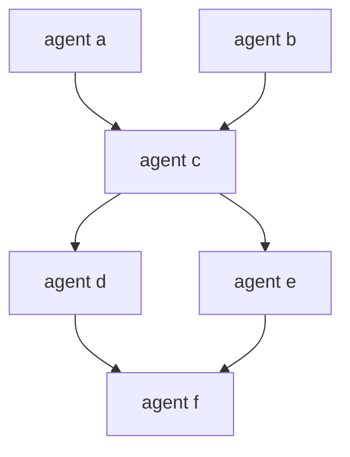

## What are Agents?

Agents are the fundamental units of execution in Engine AI. Each agent runs a prompt against a language model and produces an output. Agents can depend on other agents, creating sophisticated workflows.

## Basic Agent Structure

```rust
agent <name> {
    model <- "<provider>/<model>"
    prompt <- "<your prompt>"
}
```

### Minimal Example

```rust
provider ollama {
    driver <- "ollama"
    config <- { endpoint <- "http://localhost:11434" }
    models <- ["qwen3:8b"]
}

agent greeting {
    model <- "ollama/qwen3:8b"
    prompt <- "Say hello and introduce yourself"
}
```

## Agent Properties

### Required Properties

<ParamField path="model" type="string" required>
  The LLM model to use, in format `provider/model`
  
  ```rust
  model <- "ollama/qwen3:8b"
  ```
</ParamField>

<ParamField path="prompt" type="string" required>
  The prompt to send to the model
  
  ```rust
  prompt <- "Analyze this text"
  ```
</ParamField>

### Optional Properties

<ParamField path="output" type="schema">
  Define structured output schema
  
  ```rust
  output <- {
      title: string
      summary: string
      tags: [string]
  }
  ```
</ParamField>

<ParamField path="context" type="reference">
  Share conversation history with other agents
  
  ```rust
  context <- agent.previous.context
  ```
</ParamField>

<ParamField path="for_each" type="expression">
  Execute agent for each item in a collection
  
  ```rust
  for_each <- input.items as item
  ```
</ParamField>

## Terminal Agents

Agents marked with `<-` are **terminal agents** - their outputs are included in the final workflow result:

```rust
// Internal agent - output not returned
agent internal {
    model <- "ollama/qwen3:8b"
    prompt <- "Internal processing"
}

// Terminal agent - output returned
<- agent final {
    model <- "ollama/qwen3:8b"
    prompt <- "Final result"
}
```

<Info>
  Only terminal agents' outputs appear in the workflow result. Use this to control what data is returned.
</Info>

## Prompts

### Simple Prompts

```rust
agent task {
    model <- "ollama/qwen3:8b"
    prompt <- "Write a haiku about programming"
}
```

### Multiline Prompts

Use triple quotes for multiline prompts:

```rust
agent task {
    model <- "ollama/qwen3:8b"
    prompt <- """
        You are a helpful assistant.
        
        Please analyze the following text and provide:
        1. A summary
        2. Key themes
        3. Sentiment analysis
        
        Text: {{ input.text }}
    """
}
```

### String Interpolation

Reference inputs and other agents using `{{ }}`:

```rust
input {
    user_name: string
    topic: string
}

agent research {
    model <- "ollama/qwen3:8b"
    prompt <- "Research {{ input.topic }}"
}

agent personalize {
    model <- "ollama/qwen3:8b"
    prompt <- """
        Hello {{ input.user_name }}!
        
        Based on this research: {{ research.text }}
        
        Create a personalized summary.
    """
}
```

## Structured Outputs

Define schemas to get structured, validated data from agents:

### Inline Schemas

```rust
agent person {
    model <- "ollama/qwen3:8b"
    
    output <- {
        name: string
        age: number
        email: string
        hobbies: [string]
    }
    
    prompt <- "Generate a random person with name, age, email, and hobbies"
}
```

### Accessing Structured Data

```rust
agent use_data {
    model <- "ollama/qwen3:8b"
    prompt <- """
        Write a bio for {{ person.name }}, age {{ person.age }}.
        Their hobbies include: {{ person.hobbies }}
    """
}
```

### Complex Schemas

```rust
agent article {
    model <- "ollama/qwen3:8b"
    
    output <- {
        title: string
        author: {
            name: string
            email: string
        }
        content: string
        metadata: {
            word_count: number
            reading_time: number
            tags: [string]
        }
        published: boolean
    }
    
    prompt <- "Generate a blog article with complete metadata"
}
```

### Array Outputs

```rust
agent list_items {
    model <- "ollama/qwen3:8b"
    
    output <- {
        items: [string]
    }
    
    prompt <- "List 5 programming languages"
}

agent list_objects {
    model <- "ollama/qwen3:8b"
    
    output <- {
        users: [{
            name: string
            role: string
        }]
    }
    
    prompt <- "Generate 3 user profiles"
}
```

## Dependencies

Agents can reference outputs from other agents, creating execution dependencies:

### Simple Dependencies

```rust
agent step1 {
    model <- "ollama/qwen3:8b"
    prompt <- "Generate a topic"
}

agent step2 {
    model <- "ollama/qwen3:8b"
    prompt <- "Write about: {{ step1.text }}"
}
```

**Execution order:** `step1` runs first, then `step2` uses its output.

### Multiple Dependencies

```rust
agent research {
    model <- "ollama/qwen3:8b"
    prompt <- "Research {{ input.topic }}"
}

agent analyze {
    model <- "ollama/qwen3:8b"
    prompt <- "Analyze {{ input.topic }}"
}

agent synthesize {
    model <- "ollama/qwen3:8b"
    prompt <- """
        Synthesize these perspectives:
        Research: {{ research.text }}
        Analysis: {{ analyze.text }}
    """
}
```

**Execution order:** `research` and `analyze` run in parallel, then `synthesize` waits for both.

### Dependency Graph



Agents `a` and `b` run in parallel, then `c`, then `d` and `e` in parallel, finally `f`.

## Parallel Execution with for_each

Process collections in parallel:

### Basic for_each

```rust
input {
    items: [string]
}

agent process for_each item in input.items {
    model <- "ollama/qwen3:8b"
    output <- { result: string }
    prompt <- "Process: {{ input.item }}"
}
```

<Info>
  Inside `for_each`, use `input.item` (singular) to access the current iteration value.
</Info>

### for_each with Agent Outputs

```rust
agent generate_numbers {
    model <- "ollama/qwen3:8b"
    output <- { values: [number] }
    prompt <- "Generate 5 random numbers"
}

agent double for_each num in agent.generate_numbers.values {
    model <- "ollama/qwen3:8b"
    output <- number
    prompt <- "What is {{ input.num }} multiplied by 2?"
}
```

### Accessing for_each Results

```rust
// Results are collected in an array
agent use_results {
    model <- "ollama/qwen3:8b"
    prompt <- "Summarize these results: {{ double }}"
}
```

## Context Sharing

Share conversation history between agents for multi-turn interactions:

### Basic Context Sharing

```rust
agent start {
    model <- "ollama/qwen3:8b"
    prompt <- "Start a conversation about space exploration"
}

agent continue {
    model <- "ollama/qwen3:8b"
    context <- agent.start.context
    prompt <- "Continue the conversation with a follow-up question"
}
```

### Context Chain

```rust
agent turn1 {
    model <- "ollama/qwen3:8b"
    prompt <- "Ask a question about AI"
}

agent turn2 {
    model <- "ollama/qwen3:8b"
    context <- agent.turn1.context
    prompt <- "Answer the question and ask a follow-up"
}

agent turn3 {
    model <- "ollama/qwen3:8b"
    context <- agent.turn2.context
    prompt <- "Continue the discussion"
}
```

<Warning>
  Context accumulates conversation history. Long conversations may exceed model context limits.
</Warning>

### Compact Context

Use compact context to summarize history:

```rust
agent long_conversation {
    model <- "ollama/qwen3:8b"
    context <- agent.previous.context
    compact_context <- true  // Summarize history to save tokens
    prompt <- "Continue the conversation"
}
```

## Agent Naming

### Naming Conventions

Use descriptive, action-oriented names:

```rust
// Good names
agent analyze_sentiment { ... }
agent generate_summary { ... }
agent extract_entities { ... }
agent validate_data { ... }

// Avoid generic names
agent agent1 { ... }
agent task { ... }
agent process { ... }
```

### Name Requirements

- Must start with a letter
- Can contain letters, numbers, and underscores
- Case-sensitive
- Must be unique within the workflow

## Agent Patterns

### Pattern 1: Extract-Transform-Load

```rust
agent extract {
    model <- "ollama/qwen3:8b"
    output <- { raw_data: string }
    prompt <- "Extract data from: {{ input.source }}"
}

agent transform {
    model <- "ollama/qwen3:8b"
    output <- {
        structured: {
            name: string
            value: number
        }
    }
    prompt <- "Transform to structured format: {{ extract.raw_data }}"
}

<- agent load {
    model <- "ollama/qwen3:8b"
    prompt <- "Validate and load: {{ transform.structured }}"
}
```

### Pattern 2: Fan-Out/Fan-In

```rust
// Fan-out: Multiple agents process in parallel
agent analyze_sentiment {
    model <- "ollama/qwen3:8b"
    prompt <- "Analyze sentiment: {{ input.text }}"
}

agent extract_keywords {
    model <- "ollama/qwen3:8b"
    prompt <- "Extract keywords: {{ input.text }}"
}

agent identify_topics {
    model <- "ollama/qwen3:8b"
    prompt <- "Identify topics: {{ input.text }}"
}

// Fan-in: Combine results
<- agent synthesize {
    model <- "ollama/qwen3:8b"
    prompt <- """
        Synthesize analysis:
        Sentiment: {{ analyze_sentiment.text }}
        Keywords: {{ extract_keywords.text }}
        Topics: {{ identify_topics.text }}
    """
}
```

### Pattern 3: Pipeline

```rust
agent stage1 {
    model <- "ollama/qwen3:8b"
    prompt <- "Stage 1: {{ input.data }}"
}

agent stage2 {
    model <- "ollama/qwen3:8b"
    prompt <- "Stage 2: {{ stage1.text }}"
}

agent stage3 {
    model <- "ollama/qwen3:8b"
    prompt <- "Stage 3: {{ stage2.text }}"
}

<- agent stage4 {
    model <- "ollama/qwen3:8b"
    prompt <- "Stage 4: {{ stage3.text }}"
}
```

### Pattern 4: Consensus

```rust
// Multiple agents provide independent opinions
agent expert1 {
    model <- "ollama/qwen3:8b"
    prompt <- "Expert opinion 1: {{ input.question }}"
}

agent expert2 {
    model <- "ollama/qwen3:8b"
    prompt <- "Expert opinion 2: {{ input.question }}"
}

agent expert3 {
    model <- "ollama/qwen3:8b"
    prompt <- "Expert opinion 3: {{ input.question }}"
}

// Synthesize consensus
<- agent consensus {
    model <- "ollama/qwen3:8b"
    prompt <- """
        Build consensus from these opinions:
        1. {{ expert1.text }}
        2. {{ expert2.text }}
        3. {{ expert3.text }}
    """
}
```

## Best Practices

<AccordionGroup>
  <Accordion title="Keep prompts focused">
    Each agent should have a single, clear purpose. Break complex tasks into multiple agents.
    
    ```rust
    // Good: Focused agents
    agent summarize { prompt <- "Summarize: {{ input.text }}" }
    agent analyze { prompt <- "Analyze: {{ summarize.text }}" }
    
    // Avoid: One agent doing too much
    agent do_everything { 
        prompt <- "Summarize, analyze, and generate recommendations" 
    }
    ```
  </Accordion>

  <Accordion title="Use structured outputs">
    Define schemas for predictable, type-safe data access.
    
    ```rust
    agent structured {
        output <- { name: string, age: number }
        prompt <- "Generate person data"
    }
    ```
  </Accordion>

  <Accordion title="Minimize dependencies">
    Reduce dependencies to maximize parallel execution.
    
    ```rust
    // Good: Independent agents run in parallel
    agent task1 { ... }
    agent task2 { ... }
    agent task3 { ... }
    
    // Avoid: Unnecessary sequential dependencies
    agent task1 { ... }
    agent task2 { prompt <- "Use {{ task1.text }}" }  // Only if needed
    ```
  </Accordion>

  <Accordion title="Handle errors gracefully">
    Use schemas to validate outputs and catch errors early.
    
    ```rust
    agent validated {
        output <- {
            status: string
            data: object
        }
        prompt <- "Generate data with status"
    }
    ```
  </Accordion>
</AccordionGroup>

## Examples

### Simple Classification

```rust
input {
    text: string
}

<- agent classify {
    model <- "ollama/qwen3:8b"
    output <- {
        category: string
        confidence: number
    }
    prompt <- "Classify this text: {{ input.text }}"
}
```

### Multi-Step Analysis

```rust
input {
    document: string
}

agent summarize {
    model <- "ollama/qwen3:8b"
    output <- { summary: string }
    prompt <- "Summarize: {{ input.document }}"
}

agent extract_entities {
    model <- "ollama/qwen3:8b"
    output <- { entities: [string] }
    prompt <- "Extract entities from: {{ input.document }}"
}

<- agent generate_report {
    model <- "ollama/qwen3:8b"
    output <- {
        title: string
        summary: string
        entities: [string]
        insights: [string]
    }
    prompt <- """
        Generate report:
        Summary: {{ summarize.summary }}
        Entities: {{ extract_entities.entities }}
    """
}
```

### Batch Processing

```rust
input {
    documents: [string]
}

<- agent process_all for_each doc in input.documents {
    model <- "ollama/qwen3:8b"
    output <- {
        title: string
        summary: string
    }
    prompt <- "Process document: {{ input.doc }}"
}
```

## Next Steps

<CardGroup cols={2}>
  <Card title="Schemas" icon="table" href="/core-concepts/schemas">
    Learn about structured outputs
  </Card>
  <Card title="Dependencies" icon="link" href="/core-concepts/dependencies">
    Master agent dependencies
  </Card>
  <Card title="Context Sharing" icon="comments" href="/advanced/context-sharing">
    Deep dive into context management
  </Card>
  <Card title="Examples" icon="code" href="/examples/basic-agent">
    Explore real-world examples
  </Card>
</CardGroup>
