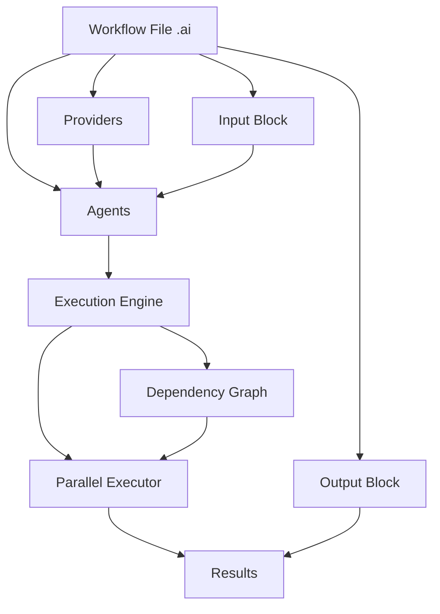

## Architecture

Engine AI workflows are composed of several key components that work together to orchestrate AI agents:



## Core Components

<CardGroup cols={2}>
  <Card title="Providers" icon="plug" href="/core-concepts/providers">
    Configure LLM backends (Ollama, OpenAI, Anthropic) that power your agents
  </Card>
  <Card title="Agents" icon="robot" href="/core-concepts/agents">
    Units of execution that run prompts against language models
  </Card>
  <Card title="Schemas" icon="table" href="/core-concepts/schemas">
    Define and validate structured outputs using JSON Schema
  </Card>
  <Card title="Workflows" icon="diagram-project" href="/core-concepts/workflows">
    Orchestrate multiple agents with dependencies and data flow
  </Card>
  <Card title="Dependencies" icon="link" href="/core-concepts/dependencies">
    Connect agents together by referencing outputs from other agents
  </Card>
</CardGroup>

## Workflow Structure

Every Engine AI workflow follows this basic structure:

```ai
// 1. Provider Configuration
provider ollama {
    driver <- "ollama"
    config <- { endpoint <- "http://localhost:11434" }
    models <- ["qwen3:8b"]
}

// 2. Input Definition (optional)
input {
    user_query: string
    context: string
}

// 3. Agent Definitions
agent analyze {
    model <- "ollama/qwen3:8b"
    output <- { sentiment: string }
    prompt <- "Analyze: {{ input.user_query }}"
}

agent respond {
    model <- "ollama/qwen3:8b"
    prompt <- "Respond based on sentiment: {{ analyze.sentiment }}"
}

// 4. Output Definition (optional)
output {
    sentiment <- agent.analyze.sentiment
    response <- agent.respond.text
}
```

## Execution Model

### Dependency Resolution

Engine AI automatically builds a dependency graph from your agents:

1. **Parse**: Read and validate the workflow file
2. **Analyze**: Identify dependencies between agents
3. **Validate**: Check for circular dependencies
4. **Optimize**: Determine which agents can run in parallel
5. **Execute**: Run agents in topologically sorted order

<Info>
  Agents with no dependencies run immediately in parallel. Dependent agents wait for their dependencies to complete.
</Info>

### Example Execution Flow

```ai
agent a {
    model <- "ollama/qwen3:8b"
    prompt <- "Task A"
}

agent b {
    model <- "ollama/qwen3:8b"
    prompt <- "Task B"
}

agent c {
    model <- "ollama/qwen3:8b"
    prompt <- "Task C using {{ a.text }} and {{ b.text }}"
}
```

**Execution order:**
1. Agents `a` and `b` run in parallel (no dependencies)
2. Agent `c` waits for both `a` and `b` to complete
3. Agent `c` runs with access to outputs from `a` and `b`

## Data Flow

### Input Flow

Data flows through your workflow in several ways:

```ai
input {
    user_data: string
}

agent process {
    model <- "ollama/qwen3:8b"
    // Access input directly
    prompt <- "Process: {{ input.user_data }}"
}

agent refine {
    model <- "ollama/qwen3:8b"
    // Access previous agent output
    prompt <- "Refine: {{ process.text }}"
}
```

### Output Flow

Agents produce outputs that can be:

1. **Unstructured text** (default): `agent.name.text`
2. **Structured data**: `agent.name.field_name`
3. **Context**: `agent.name.context` (conversation history)

```ai
agent structured {
    model <- "ollama/qwen3:8b"
    output <- {
        title: string
        summary: string
        tags: [string]
    }
    prompt <- "Generate article metadata"
}

agent use_output {
    model <- "ollama/qwen3:8b"
    // Access structured fields
    prompt <- "Write about {{ structured.title }} with tags: {{ structured.tags }}"
}
```

## Terminal Agents

Agents marked with `<-` are **terminal agents** - their outputs are included in the final workflow result:

```ai
agent internal {
    model <- "ollama/qwen3:8b"
    prompt <- "Internal processing"
}

<- agent final {
    model <- "ollama/qwen3:8b"
    prompt <- "Final result using {{ internal.text }}"
}
```

Only `final` agent's output appears in the workflow result, even though `internal` executes.

<Tip>
  Use terminal agents to control what data is returned from your workflow. This keeps results clean and focused.
</Tip>

## Variable Scopes

Engine AI has three variable scopes:

### 1. Input Scope

Access workflow inputs:

```ai
input {
    name: string
}

agent greet {
    prompt <- "Hello {{ input.name }}"
}
```

### 2. Agent Scope

Access other agent outputs:

```ai
agent first {
    prompt <- "Generate a topic"
}

agent second {
    prompt <- "Write about {{ agent.first.text }}"
}
```

### 3. Local Scope (for_each)

Access iteration variables:

```ai
agent process for_each item in input.items {
    prompt <- "Process {{ input.item }}"
}
```

## Type System

Engine AI supports these data types:

| Type | Description | Example |
|------|-------------|---------|
| `string` | Text data | `"hello"` |
| `number` | Numeric values | `42`, `3.14` |
| `boolean` | True/false | `true`, `false` |
| `[type]` | Arrays | `[string]`, `[number]` |
| `object` | Nested objects | `{ name: string, age: number }` |
| `null` | Null value | `null` |

### Schema Validation

Outputs are validated against their schemas:

```ai
agent person {
    model <- "ollama/qwen3:8b"
    
    output <- {
        name: string
        age: number
        email: string
    }
    
    prompt <- "Generate a person"
}
```

If the agent returns invalid data (e.g., `age` as a string), the workflow fails with a validation error.

## Error Handling

Engine AI provides detailed error messages:

- **Parse errors**: Syntax issues with line/column numbers
- **Validation errors**: Schema mismatches with expected vs actual types
- **Execution errors**: Provider failures, timeouts, or agent errors
- **Dependency errors**: Circular dependencies or missing references

```
Error: Circular dependency detected
  Agent 'a' depends on 'b'
  Agent 'b' depends on 'a'
  
  at workflow.ai:15:5
```

## Performance Optimization

### Automatic Parallelization

Independent agents run in parallel automatically:

```ai
// These three agents run simultaneously
agent task1 { ... }
agent task2 { ... }
agent task3 { ... }

// This waits for all three
agent combine {
    prompt <- "Combine {{ task1.text }}, {{ task2.text }}, {{ task3.text }}"
}
```

### Caching

Provider responses can be cached to avoid redundant API calls:

```ai
provider ollama {
    driver <- "ollama"
    config <- { 
        endpoint <- "http://localhost:11434"
        cache_ttl <- 3600  // Cache for 1 hour
    }
    models <- ["qwen3:8b"]
}
```

### Batch Processing

Use `for_each` for efficient batch processing:

```ai
agent process for_each item in input.items {
    model <- "ollama/qwen3:8b"
    prompt <- "Process {{ input.item }}"
}
```

All iterations execute in parallel, limited only by your provider's rate limits.

## Best Practices

<AccordionGroup>
  <Accordion title="Keep agents focused">
    Each agent should have a single, clear responsibility. Break complex tasks into multiple agents.
  </Accordion>

  <Accordion title="Use structured outputs">
    Define schemas for agent outputs to ensure data consistency and enable type-safe access.
  </Accordion>

  <Accordion title="Minimize dependencies">
    Reduce dependencies between agents to maximize parallelization opportunities.
  </Accordion>

  <Accordion title="Name agents descriptively">
    Use clear, descriptive names that indicate what each agent does.
  </Accordion>

  <Accordion title="Validate early">
    Use schemas to catch data issues early rather than propagating errors through the workflow.
  </Accordion>
</AccordionGroup>

## Next Steps

<CardGroup cols={2}>
  <Card title="Providers" icon="plug" href="/core-concepts/providers">
    Learn how to configure LLM providers
  </Card>
  <Card title="Agents" icon="robot" href="/core-concepts/agents">
    Deep dive into agent configuration
  </Card>
  <Card title="Schemas" icon="table" href="/core-concepts/schemas">
    Master structured outputs
  </Card>
  <Card title="Workflows" icon="diagram-project" href="/core-concepts/workflows">
    Build complex workflows
  </Card>
</CardGroup>
